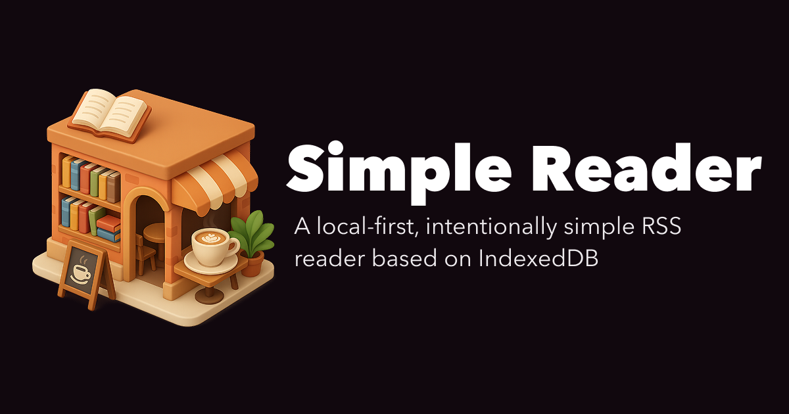

# Simple Reader

Simple Reader is a local-first RSS and Atom reader. Subscriptions, article state, and saved
articles stay in the browser, while a small Cloudflare Worker safely fetches and normalizes
remote feeds.



## Features

- Subscribe directly to RSS or Atom feeds, or discover feeds from a website URL.
- Browse all, unread, starred, and per-feed article views.
- Keep subscriptions, read state, and starred articles in IndexedDB.
- Refresh stale feeds on startup and window focus, with manual per-feed and global refreshes.
- Sanitize publisher HTML before rendering it.
- Use a bounded, rate-limited Worker API with HTTPS-only destination and redirect validation.
- Work across desktop and narrow-screen layouts with accessible, semantic controls.

## Architecture

Simple Reader has two independently deployed parts:

- The React application is built with Vite+ and hosted on Cloudflare Pages.
- The feed API runs as a Cloudflare Worker at `GET /api/feed?url=<encoded-url>`.

The browser stores reader data locally with Dexie and IndexedDB. The Worker fetches RSS, Atom,
or website documents, discovers feeds where necessary, and returns normalized JSON. It does not
act as a general-purpose content proxy.

## Local development

Prerequisites:

- Node.js and npm versions compatible with the repository's `devEngines` configuration.
- The Vite+ `vp` command.
- Varlock for project configuration and secret handling.

Install dependencies:

```sh
vp install
```

Start the frontend:

```sh
npm run dev:ui
```

Start the Worker API in another terminal:

```sh
npm run dev
```

Configuration is declared in [`.env.schema`](.env.schema). Use Varlock-managed configuration;
do not add raw secrets to local environment files or the repository.

## Validation

Run the primary project checks before opening a pull request:

```sh
vp check
vp test
npm run test:worker-runtime
npm run build
```

Additional checks are available through the scripts in [`package.json`](package.json), including
Playwright end-to-end tests, Stylelint, React Doctor, and Varlock validation.

## Deployment

The frontend and Worker deploy independently.

When the Cloudflare Pages Git integration described in
[`docs/cloudflare-pages.md`](docs/cloudflare-pages.md) is enabled, merging into `main` triggers a
new Pages build and deployment. That deployment does **not** update the feed Worker.

Deploy Worker code or `wrangler.jsonc` changes separately:

```sh
npm run deploy
```

This command builds the project and deploys through `varlock-wrangler`. A separate Cloudflare
dashboard Git build for the Worker may automate this step, but this repository does not currently
contain a GitHub Actions Worker deployment workflow.

For Pages configuration, CORS setup, and manual Pages deployment, see
[`docs/cloudflare-pages.md`](docs/cloudflare-pages.md).

## Project scope

Version 1 is intentionally a single-user, single-browser reader. Cross-device sync, accounts,
folders, tags, search, OPML, notifications, recommendations, and background scheduling are outside
the current scope. See [`plans/simple-reader-v1.md`](plans/simple-reader-v1.md) for implementation
details and constraints.

## License

Simple Reader is available under the [MIT License](LICENSE).
